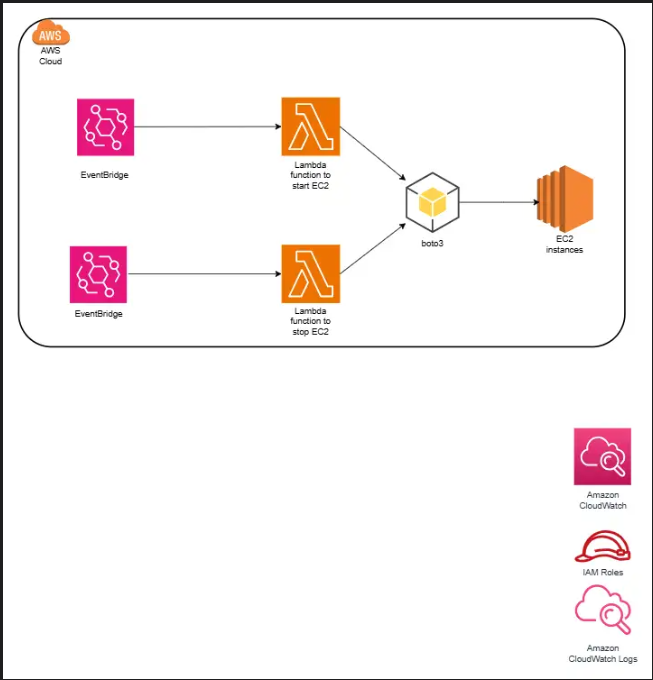

# ec2-instance-scheduler
This repository contains AWS lambda functions to start and stop EC2 instances at scheduled time using EventBridge(CloudWatch Events).
## Overview
- The 'start_instance.py' function starts an EC2 instance.
- The 'stop_instance.py' finction stopps and EC2 instance.
### Schedule
- **Start Instance:** Every 30 minutes from 8 AM to 5 PM, Monday to Friday.
- **Stop Instance:** At 5:02 PM, Monday to Friday.

## Architectural Diagram


## Setup
1. Create two lambda functions in the AWS Lambda console.
2. Upload 'start_instance.py' function.
3. Upload 'stop_instance.py' function.
4. Ensure both Lambda functions have an execution role with the necessary permissions to start and stop EC2 instances.
5. Create a EventBridge rules to trigger the Lambda functions according to the specified schedule.

### EventBridge Rules
- **Start Instance Rule:**
  - Schedule: 'cron(0/30 9-16 ? * MON-FRI *)
  - Target: Lambda function 'start_ec2_instance.py'
- **Stop Instance Rule:**
  - Schedule: 'cron(2 17 ? * MON-FRI *)'
  - Target: Lambda function 'stop_ec2_instance.py'

## Permissions
### IAM Policy
The Lambda execution role should include the following policy:
```json
{
    "Version": "2012-10-17",
    "Statement": [
        {
            "Sid": "VisualEditor0",
            "Effect": "Allow",
            "Action": "ec2:*",
            "Resource": "*"
        },
        {
            "Sid": "VisualEditor1",
            "Effect": "Allow",
            "Action": "logs:CreateLogGroup",
            "Resource": "arn:aws:logs:us-east-1:aws_account_id:*"
        },
        {
            "Sid": "VisualEditor2",
            "Effect": "Allow",
            "Action": [
                "logs:CreateLogStream",
                "logs:PutLogEvents"
            ],
            "Resource": "arn:aws:logs:us-east-1:aws_account_id:log-group:/aws/lambda/Stop_EC2_INSTANCE_AT_A_CERTAIN_TIME:*"
        }
    ]
}


